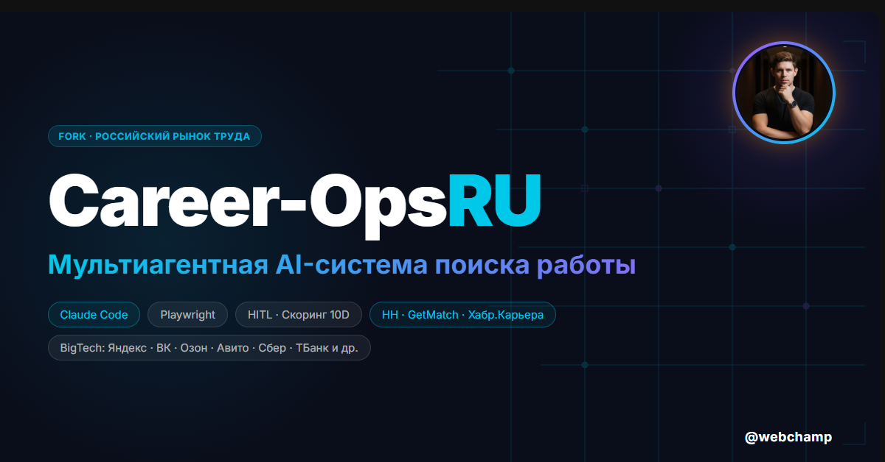

# Career-Ops RU

[Русский](README.md) | [English (original)](https://github.com/santifer/career-ops)

<p align="center">
  <a href="https://t.me/webchamp_public"></a>
</p>

<p align="center">
  Компании используют AI для автофильтрации кандидатов.  <strong>Я дал кандидатам AI, чтобы они <em>выбирали</em> компании сами.</strong><br>
  <em>Форк оригинального career-ops, адаптированный под российский рынок труда.</em>
</p>

<p align="center">
  
  
  
  
  
  
  
  <br>
  
  
</p>

---

<p align="center">
  
</p>

<p align="center"><strong>Форк career-ops · Адаптация под hh.ru, Habr Career, getmatch.ru · Русскоязычные промпты и архетипы</strong></p>

## Что это такое

Career-Ops RU превращает Claude Code в полноценный командный центр поиска работы на российском рынке.
Вместо ручного отслеживания откликов в таблицах - AI-пайплайн, который:

- **Оценивает вакансии** по системе A–F (10 взвешенных параметров)
- **Генерирует PDF-резюме** — ATS-оптимизированные, адаптированные под конкретную вакансию
- **Сканирует порталы** — hh.ru, Habr Career, getmatch.ru + западные Greenhouse/Ashby/Lever
- **Обрабатывает пакетно** — оценка 10+ вакансий параллельно через sub-agents
- **Ведёт трекер** — единая база с дедупликацией и проверкой целостности

> **Важно: это НЕ инструмент для массовой рассылки откликов.** Career-ops — это фильтр.
> Он помогает найти 3–5 вакансий в неделю, которые реально стоят вашего времени из сотен доступных.
> Система настоятельно рекомендует не откликаться на вакансии со скором ниже 4.0/5.
> **Всегда проверяйте контент перед отправкой — финальное решение за вами.**

> **Первые оценки будут неточными.** Система ещё вас не знает. Добавьте контекст: cv.md, карьерную историю, доказательства достижений, предпочтения. Чем больше вы её «обучаете», тем точнее становятся оценки — как стажёр-рекрутер в первую неделю.

Форк создан на базе [career-ops by Santiago Fernández de Valderrama](https://github.com/santifer/career-ops).

## Возможности

| Feature | Description |
|---------|-------------|
| **Auto-Pipeline** | Paste a URL, get a full evaluation + PDF + tracker entry |
| **6-Block Evaluation** | Role summary, CV match, level strategy, comp research, personalization, interview prep (STAR+R) |
| **Interview Story Bank** | Accumulates STAR+Reflection stories across evaluations -- 5-10 master stories that answer any behavioral question |
| **Negotiation Scripts** | Salary negotiation frameworks, geographic discount pushback, competing offer leverage |
| **ATS PDF Generation** | Keyword-injected CVs with Space Grotesk + DM Sans design |
| **Portal Scanner** | 45+ companies pre-configured (Anthropic, OpenAI, ElevenLabs, Retool, n8n...) + custom queries across Ashby, Greenhouse, Lever, Wellfound |
| **Batch Processing** | Parallel evaluation with `claude -p` workers |
| **Dashboard TUI** | Terminal UI to browse, filter, and sort your pipeline |
| **Human-in-the-Loop** | AI evaluates and recommends, you decide and act. The system never submits an application -- you always have the final call |
| **Pipeline Integrity** | Automated merge, dedup, status normalization, health checks |
-----
| **HH + Habr Career + GetMatch** | Предустановленные запросы для российских IT-площадок |
| **Русскоязычные архетипы** | AI Инженер, Fullstack разработчик, Продакт менеджер, AI Архитектор |
| **Русскоязычные промпты** | Режимы оценки и скрипты переговоров адаптированы на русский язык |
| **RU зарплатный скоринг** | Сравнение в рублях gross/net, учёт IT-льготы по НДФЛ |
| **Российские компании** | Yandex, Sber AI, Tinkoff Tech, VK, Avito, JetBrains, Kaspersky и другие |
| **profile.yml на русском** | Шаблон профиля с русскоязычными полями и комментариями |
| **portals.yml (RU версия)** | 55+ компаний: российские + релевантные международные |

## Быстрый старт

```bash
# 1. Клонировать и установить
git clone https://github.com/aleksnick93/career-ops-ru.git
cd career-ops-ru && npm install
npx playwright install chromium   # нужен для генерации PDF

# 2. Проверить установку
npm run doctor

# 3. Настроить профиль
cp config/profile.example.yml config/profile.yml   # заполнить своими данными
cp templates/portals.example.yml portals.yml        # настроить компании

# 4. Добавить резюме
# Создать cv.md в корне проекта (markdown-формат)

# 5. Создать файл трекера
mkdir -p data && touch data/applications.md

# 6. Персонализировать через Claude
claude   # открыть Claude Code в этой папке

# Примеры запросов к Claude:
# "Добавь вакансии с hh.ru в portals.yml"
# "Переведи все архетипы под AI-инженера"
# "Обнови мой профиль на основе этого резюме"
# "Добавь Яндекс и Сбер в список компаний"

# 7. Начать работу
# Вставить URL вакансии или запустить /career-ops
```

> **Система сделана так, чтобы её адаптировал сам Claude.** Режимы, архетипы, веса скоринга, скрипты переговоров — просто попросите Claude изменить их. Он читает те же файлы, которые исполняет.

Подробная инструкция: [docs/SETUP.md](docs/SETUP.md)

## Команды

Career-ops — одна slash-команда с множеством режимов:

```
/career-ops                    → Показать все доступные команды
/career-ops {URL или текст}    → Полный пайплайн (оценка + PDF + трекер)
/career-ops scan               → Сканировать порталы на новые вакансии
/career-ops pdf                → Сгенерировать ATS-оптимизированное резюме
/career-ops batch              → Пакетная оценка 10+ вакансий
/career-ops tracker            → Просмотр статуса откликов
/career-ops apply              → Заполнение форм отклика через AI
/career-ops pipeline           → Обработать очередь URL
/career-ops contacto           → Сообщение для аутрича в LinkedIn / Telegram
/career-ops deep               → Глубокое исследование компании
/career-ops training           → Оценить курс или сертификат
/career-ops project            → Оценить проект из портфолио
```

Или просто вставьте URL вакансии или её текст — система автоматически определит и запустит полный пайплайн.

## Как это работает

```
Вы вставляете URL или текст вакансии
              │
              ▼
   ┌──────────────────────┐
   │  Определение         │  Классификация: AI Инженер / Fullstack разработчик / Продакт менеджер /
   │  Архетипа            │  No-Code Специалист / AI Архитектор
   └──────────┬───────────┘
              │
   ┌──────────▼───────────┐
   │  Оценка A–F          │  Соответствие, пробелы, зарплата, STAR-истории
   │  (из cv.md)          │
   └──────────┬───────────┘
              │
         ┌────┼─────┐
         ▼    ▼     ▼
      Отчёт  PDF  Трекер
       .md  .pdf   .tsv
```

## Подключённые порталы

Сканер включает **55+ компаний** и **18 поисковых запросов** по основным российским и международным площадкам.

### Российские компании
**AI-first:** Yandex AI/Cloud, Sber AI/GigaChat, VK Tech, Tinkoff Tech, Avito Tech, Ozon Tech
**Dev Tools:** JetBrains, Kaspersky Lab

### Международные компании
**AI Labs:** Anthropic, OpenAI, Mistral, Cohere, Hugging Face, Perplexity
**Автоматизация:** n8n, Zapier, Make.com, Clay Labs
**AI Контент:** ElevenLabs, HeyGen, Synthesia, Runway, Black Forest Labs (FLUX)
**AI Infra/LLMOps:** LangChain, Langfuse, Pinecone, Arize AI, Weights & Biases
**Dev Platforms:** Vercel, Retool, Airtable, Lovable, WorkOS, Temporal
**Europe Remote:** Attio, Glean, Hightouch, Photoroom, Lindy

### Площадки для поиска
**Российские:** hh.ru API, Habr Career, getmatch.ru
**Международные:** Ashby, Greenhouse, Lever, Wellfound, Workable, RemoteFront

## Дашборд

Встроенный дашборд для просмотра пайплайна в терминале:

```bash
cd dashboard
go build -o career-dashboard.exe .    # Windows
# go build -o career-dashboard .      # macOS / Linux
./career-dashboard.exe --path ..
```

Возможности: 6 вкладок-фильтров, 4 режима сортировки, группировка, предпросмотр, смена статуса.

## Структура проекта

```
career-ops-ru/
├── CLAUDE.md                    # Инструкции для агента (на русском)
├── cv.md                        # Ваше резюме (создать)
├── article-digest.md            # Доказательства достижений (опционально)
├── config/
│   └── profile.example.yml      # Шаблон профиля
├── modes/                       # 14 режимов работы
│   ├── _shared.md               # Общий контекст (настроить под себя)
│   ├── oferta.md                # Оценка вакансии
│   ├── pdf.md                   # Генерация PDF
│   ├── scan.md                  # Сканер порталов
│   ├── batch.md                 # Пакетная обработка
│   └── ...
├── templates/
│   ├── cv-template.html         # ATS-шаблон резюме
│   ├── portals.example.yml      # Шаблон конфига сканера
│   └── states.yml               # Статусы откликов
├── batch/
│   ├── batch-prompt.md          # Промпт воркера
│   └── batch-runner.sh          # Оркестратор
├── dashboard/                   # Go веб-дашборд
├── data/                        # Данные трекера (в .gitignore)
├── reports/                     # Отчёты оценок (в .gitignore)
├── output/                      # Сгенерированные PDF (в .gitignore)
├── fonts/                       # Space Grotesk + DM Sans
├── docs/                        # Установка, настройка, архитектура
└── examples/                    # Образцы резюме, отчеты
```

## Технологический стек


- **Агент:** Claude Code с кастомными режимами и инструкциями
- **PDF:** Playwright + HTML-шаблон с кириллическими шрифтами
- **Сканер:** Playwright + hh.ru API + Greenhouse API + WebSearch
- **Дашборд:** Go + Bubble Tea + Lipgloss (тема Catppuccin Mocha)
- **Данные:** Markdown-таблицы + YAML-конфиги + TSV-файлы

## Об авторе форка

Меня зовут Александр — AI-инженер и fullstack-разработчик из Москвы с 10+ летним опытом.
Создаю AI-системы на базе LLM и автоматизации: от архитектуры до прода.
Автор Telegram-бота [@ai_photomaster_bot](https://t.me/ai_photomaster_bot) и других AI-инструментов.

## Оригинальный проект

Форк создан на базе **[career-ops by Santiago Fernández de Valderrama](https://github.com/santifer/career-ops)**.
Santiago — Head of Applied AI, использовал систему для оценки 740+ вакансий и получил оффер мечты.
[Читать кейс-стади](https://santifer.io/career-ops-system) · ☕ [Buy Santiago a coffee](https://buymeacoffee.com/santifer)

## Отказ от ответственности

**career-ops RU — локальный open-source инструмент, НЕ хостируемый сервис.** Используя этот инструмент, вы подтверждаете:

1. **Ваши данные — у вас.** CV, контакты и персональные данные остаются на вашем устройстве и передаются только напрямую провайдеру AI (Anthropic, OpenAI и др.). Мы не собираем и не имеем доступа к вашим данным.
2. **Вы управляете AI.** Промпты по умолчанию запрещают автоматическую отправку откликов. **Всегда проверяйте AI-сгенерированный контент перед отправкой.**
3. **Вы соблюдаете ToS платформ.** Используйте инструмент в соответствии с правилами hh.ru, Habr Career, LinkedIn и других платформ. Не используйте для спама работодателям.
4. **Без гарантий.** Оценки — рекомендации, не истина. AI-модели могут галлюцинировать. Авторы не несут ответственности за исход трудоустройства.

Полные условия: [LEGAL_DISCLAIMER.md](LEGAL_DISCLAIMER.md) · Лицензия: [MIT](LICENSE)

## Лицензия

MIT — форк оригинального [career-ops](https://github.com/santifer/career-ops) by Santiago Fernández de Valderrama.

## Связаться

[](https://t.me/webchamp)
[](https://linkedin.com/in/webchamp)
[](https://github.com/aleksnick93)